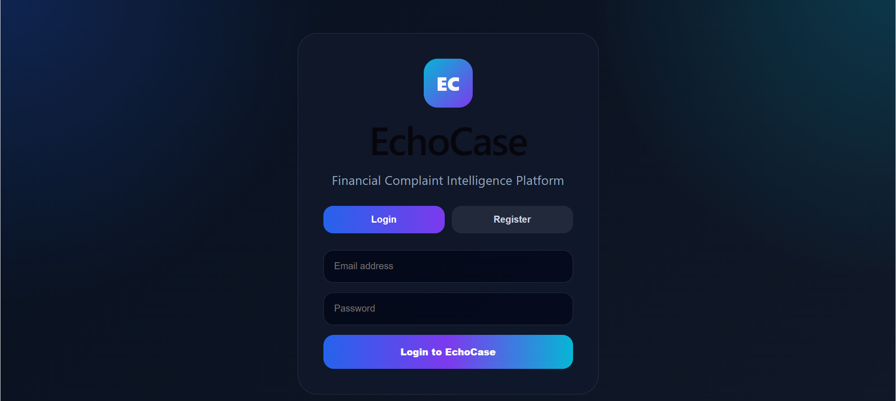
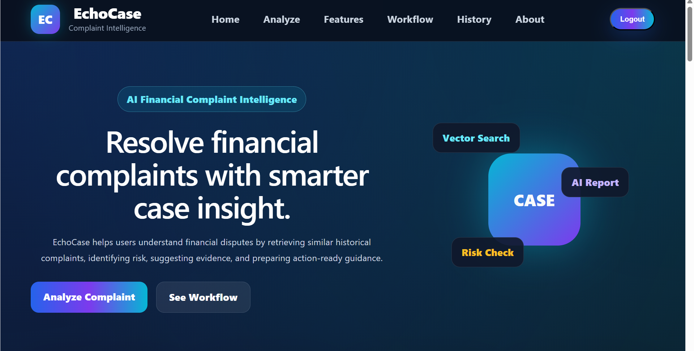
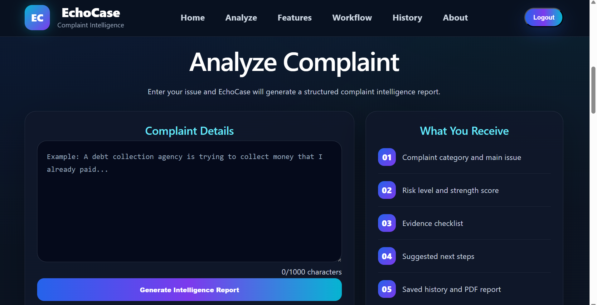
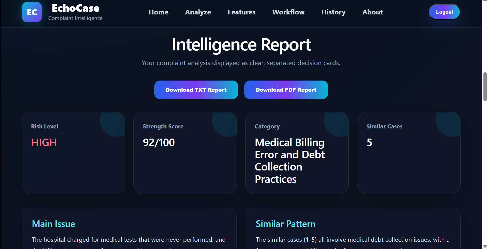
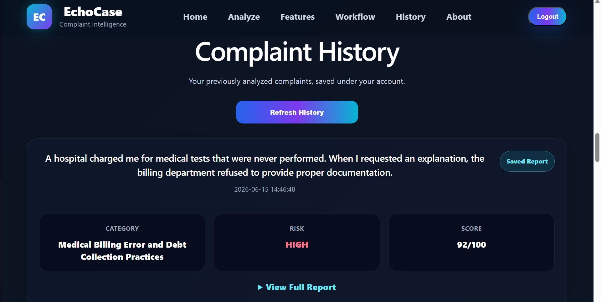

# EchoCase – Financial Complaint Intelligence Platform

EchoCase is an AI-powered complaint intelligence platform that helps users analyze financial complaints, identify risks, retrieve similar historical complaint patterns, and generate structured guidance reports.

The platform combines Semantic Search, Vector Search (FAISS), Retrieval-Augmented Generation (RAG), and Large Language Models (LLMs) to provide actionable complaint insights and consumer guidance.

---

## Features

### User Authentication
- User Registration
- User Login
- Secure Password Storage
- Logout Functionality

### Complaint Analysis
- AI-powered complaint understanding
- Complaint category identification
- Main issue detection
- Risk assessment
- Complaint strength scoring

### Similar Case Retrieval
- Semantic similarity search
- Historical complaint pattern matching
- FAISS vector database retrieval

### AI Intelligence Report
- Risk level assessment
- Similar case patterns
- Evidence checklist
- Consumer guidance
- Suggested next steps
- Draft complaint statement

### Complaint History
- User-specific complaint storage
- Analysis history tracking
- Persistent complaint records

### Report Generation
- Download TXT report
- Download PDF report

---

# Screenshots

## Login Page



---

## Home Dashboard



---

## Complaint Analysis



---

## Intelligence Report



---

## Complaint History



---

# System Architecture

```text
User Complaint
       │
       ▼
React Frontend
       │
       ▼
FastAPI Backend
       │
       ▼
Sentence Transformer
       │
       ▼
FAISS Vector Search
       │
       ▼
Retrieve Similar Cases
       │
       ▼
Groq LLM
       │
       ▼
AI Intelligence Report
       │
       ▼
Save to User History
```

---

# Technology Stack

## Frontend
- React.js
- Vite
- Axios
- CSS3

## Backend
- FastAPI
- Python
- Uvicorn

## Database
- SQLite

## AI & NLP
- Sentence Transformers
- FAISS
- Groq LLM

## Runtime
- Node.js
- npm

## Report Generation
- jsPDF

---

# Project Structure

```text
EchoCase
│
├── frontend/
│   ├── src/
│   │   ├── App.jsx
│   │   ├── App.css
│   │   └── main.jsx
│   │
│   ├── package.json
│   └── vite.config.js
│
├── screenshots/
│   ├── login.png
│   ├── home.png
│   ├── analyze.png
│   ├── report.png
│   └── history.png
│
├── main.py
├── requirements.txt
├── README.md
├── complaints.csv
├── echo_case_faiss.index
├── echo_case_texts.pkl
└── build_vector_db.py
```

---

# Installation

## Clone Repository

```bash
git clone https://github.com/your-username/EchoCase.git
cd EchoCase
```

---

## Backend Setup

Install dependencies:

```bash
pip install -r requirements.txt
```

Create a `.env` file:

```env
GROQ_API_KEY=your_groq_api_key
```

Run backend:

```bash
uvicorn main:app --reload
```

Backend URL:

```text
http://127.0.0.1:8000
```

Swagger Documentation:

```text
http://127.0.0.1:8000/docs
```

---

## Frontend Setup

Navigate to frontend:

```bash
cd frontend
```

Install dependencies:

```bash
npm install
```

Run frontend:

```bash
npm run dev
```

Frontend URL:

```text
http://localhost:5173
```

---

# API Endpoints

## Authentication

### Register

```http
POST /register
```

### Login

```http
POST /login
```

---

## Complaint Analysis

```http
POST /analyze
```

---

## Complaint History

```http
GET /history/{user_id}
```

---

# Sample Complaint

```text
A debt collection agency is attempting to collect a debt that I have already paid. Despite providing payment receipts, they continue contacting me and threatening legal action.
```

---

# Example Report Output

The generated intelligence report includes:

- Complaint Category
- Main Issue Identified
- Risk Level
- Similar Case Pattern
- Complaint Strength Score
- Evidence Checklist
- Consumer Guidance
- Suggested Next Steps
- Draft Complaint Statement

---

# Future Enhancements

- Email notifications
- Complaint tracking system
- Admin dashboard
- Multi-language support
- Cloud database integration
- Mobile application
- Analytics dashboard
- Advanced authentication

---

# Learning Outcomes

This project demonstrates practical implementation of:

- Retrieval-Augmented Generation (RAG)
- Semantic Search
- Vector Databases
- FastAPI Development
- React Development
- REST APIs
- User Authentication
- SQLite Database Management
- PDF Report Generation
- AI-powered Decision Support Systems

---

# Author

**Sumana Sree Karani**

B.Tech – Computer Science Engineering

SRM University – AP

---

# License

This project is developed for educational and learning purposes.

© 2026 EchoCase. All rights reserved.